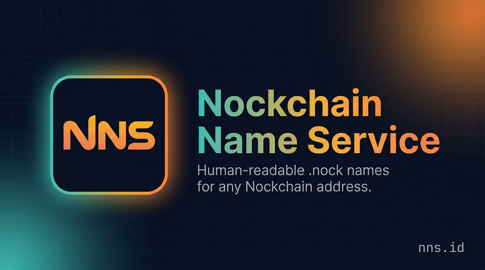

# NNS — Nockchain Name Service

The human-readable naming layer for Nockchain. Register, resolve, and manage
`.nock` names at [nns.id](https://nns.id).



## Stack

- React 19 + Vite 7
- Tailwind CSS 4 with a custom navy / orange / teal neon palette
- Cloudflare Workers (static asset serving via Wrangler)
- `@nockchain/sdk` + Rose wallet for on-chain payments
- Public resolver API at `https://api.nns.id`

## Develop

```bash
npm install
npm run dev        # localhost:5173
npm run lint
npm run build
npm test
```

## Deploy

```bash
npm run deploy           # production (nns.id)
npm run deploy:preview   # preview version
```

## Docs

- Protocol & milestones: [/grant](https://nns.id/grant)
- API reference: [/developers](https://nns.id/developers)
